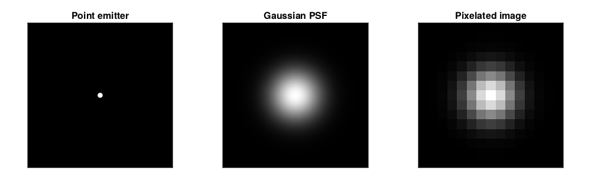

# Code Optimization in Scientific Research (Part I)

- [Code Optimization in Scientific Research (Part I)](#code-optimization-in-scientific-research-part-i)
  - [Introduction](#introduction)
  - [Description of the problem](#description-of-the-problem)
  - [A naive implementation](#a-naive-implementation)
  - [Optimization ideas](#optimization-ideas)
    - [Follow memory layout](#follow-memory-layout)
    - [Reduce memory allocation](#reduce-memory-allocation)
    - [Vectorization](#vectorization)

## Introduction

Scientific research is inherently linked to the collection and analysis of data. In today's world, the volume of data involved in most scientific research projects far exceeds what can be managed manually. As a result, scientific computing has become an essential requirement for conducting research.

Despite the remarkable progress in modern programming languages and numerical tools, continually enhanced by scientists and software developers, non-experts still face challenges when it comes to conducting efficient computations on computers for specific research purposes. This can be attributed to the following factors:

- Achieving optimal code performance necessitates a comprehensive evaluation of various factors, including hardware specifications, software components, algorithmic efficiency, and the scale of computations.
- Scientists need to find a balance between computational efficiency and development efficiency. They cannot afford to spend excessive time conducting meticulous benchmarks and analyze their statistics.
- While programming languages and numerical tools frequently offer extensive performance tips, they are typically presented in technical jargon, making them less accessible to non-experts.
- Additionally, the examples provided in these resources often lack interconnectedness, making it challenging to grasp their practical application collectively.

To tackle these concerns, this blog post aims to offer a concise overview of various general and highly effective optimization techniques that are relatively straightforward to implement. The focus will be on a problem I encountered during my research on single-molecule imaging. I will begin with a naive version of my code and gradually enhance its performance.

:exclamation: All my codes below are provided in terms of an interactive notebook at [my GitHub](https://github.com/lanceXwq/BlogPostFiles/tree/main/230728%20Code%20Optimization%20I).

## Description of the problem

In my research, which involves applications such as [super-resolution imaging](https://en.wikipedia.org/wiki/Super-resolution_microscopy), I frequently need to simulate microscope images of individual molecules in the visible spectrum using photon-sensing devices. In this scenario, individual molecules can be accurately represented as point emitters, meaning they are so small that their structures and shapes become insignificant. However, from a physics standpoint, we cannot simply observe sharp, bright dots in microscope images due to two reasons:

- The diffraction of light causes a point object to appear as an expanded blur, often referred to as the [point spread function (PSF)](https://en.wikipedia.org/wiki/Point_spread_function).
- In images, PSFs are pixelated because the pixel sizes of the detectors are often comparable to the width of a PSF.

<p align="center" height="100%">
    
</p>

<!--  -->

Simulating a single-molecule image involves converting point emitters into their corresponding PSFs and then pixelating the entire image. In these simulations (as well as in the corresponding experimental setups), it is often reasonable to assume that the point emitters are sufficiently far apart from each other, allowing for independent photon emissions. This means that we can calculate the PSF for each molecule individually and combine them.

Since providing an accurate and detailed simulation process is beyond the scope of this blog, we will make the following approximations:

- The pixel size is so small that the impact of pixelization can be considered negligible.
- The PSF is a 2D Gaussian. In other words, for a molecule located at coordinates $(x_n, y_n)$, its influence on the pixel at $(x^p_i, y^p_j)$ is determined by $$PSF_{ijn}=\exp[-(x^p_i-x_n)^2-(y^p_j-y_n)^2]$$ where $n$ represents the molecule index, and $i$ and $j$ denote the pixel indices.

## A naive implementation

Now, let's move forward with writing a straightforward simulation code. To accomplish this, I will utilize [Julia](https://julialang.org/) as the preferred programming language. As mentioned previously, we need to compute the PSF value for every $n$, $i$, and $j$. Translating this sentence into code results in the following:

```julia
function image_sim_v1(xᵖ, yᵖ, x, y)
    PSF = zeros(length(x), length(xᵖ), length(yᵖ))
    for n in eachindex(x), i in eachindex(xᵖ), j in eachindex(yᵖ)
        PSF[n, i, j] = exp(-(xᵖ[i] - x[n])^2 - (yᵖ[j] - y[n])^2)
    end
    return dropdims(sum(PSF, dims = 1), dims = 1)
end
```

For a test case with 20 emitting molecules in a 256$\times$256 image, this short function does get the job done (see the image below). Conduct a brief benchmark on this function yields `13.827 ms (7 allocations: 10.50 MiB)`.

<p align="center" height="100%">
    
</p>

<!--  -->

## Optimization ideas

Now we can begin the process of optimizing `image_sim_v1`. Let's start with some simple modifications then move on to more involved techniques.

### Follow memory layout

Before explaining anything in words, let's take a look at the following code:

```julia
function image_sim_v2(xᵖ, yᵖ, x, y)
    PSF = zeros(length(x), length(xᵖ), length(yᵖ))
    for j in eachindex(yᵖ), i in eachindex(xᵖ), n in eachindex(x)
        PSF[n, i, j] = exp(-(xᵖ[i] - x[n])^2 - (yᵖ[j] - y[n])^2)
    end
    return dropdims(sum(PSF, dims = 1), dims = 1)
end
```

By comparing `image_sim_v2` with `image_sim_v1`, I merely altered the order of the nested for-loops. Upon benchmarking `image_sim_v2`, which recorded `8.362 ms (7 allocations: 10.50 MiB)`, we obtain a performance improvement of over 30% through this seemingly insignificant modification!

The explanation is straightforward: variables are stored in a computer's memory, and accessing this memory requires time. Objects such as arrays are usually stored in a continuous block of memory, and retrieving variables in the order they are stored naturally results in faster retrieval. By interchanging the order of the `j`-loop and the `n`-loop, the innermost loop of `image_sim_v2` consistently operates on a contiguous memory block. It's important to note that different programming languages may have different memory layout conventions, so it's advisable to consult the documentation for specific details.

### Reduce memory allocation

Similar to accessing memory, memory allocation can also be a time-consuming process. In general, implementing the same algorithm with reduced memory allocation results in improved performance. Furthermore, this improvement tends to be more pronounced when dealing with larger datasets.

Is there unnecessary memory allocation in `image_sim_v2`? The answer is yes. It should be noted that there is no need to store the PSF of each molecule, as we are solely concerned with the final image. Consequently, we can allocate memory for just one image and update the value of each pixel:

```julia
function image_sim_v3(xᵖ, yᵖ, x, y)
    PSF = zeros(length(xᵖ), length(yᵖ))
    for j in eachindex(yᵖ), i in eachindex(xᵖ), n in eachindex(x)
        PSF[i, j] += exp(-(xᵖ[i] - x[n])^2 - (yᵖ[j] - y[n])^2)
    end
    return PSF
end
```

Benchmarking `image_sim_v3` recorded `8.290 ms (2 allocations: 512.05 KiB)`. While there is potential for further improvements by optimizing memory usage, such as exploring "mutating functions", pursuing this path is no longer fruitful. Although `image_sim_v3`` managed to reduce memory allocation by a factor of 20, it only resulted in a decrease in computation time of less than 0.3 ms. This outcome was expected since the test case was intentionally designed to be small. Therefore, it is now time to focus on algorithmic optimizations.

### Vectorization

Vectorization is arguably the most crucial technique discussed in this blog. Its concept is straightforward: execute computations in a manner that aligns with array (matrix or vector) operations (such as matrix multiplication and element-wise operations). By adopting this approach, we can achieve two significant advantages:

- Eliminate the need for slow for-loops, which tend to hinder performance in languages like Python or MATLAB.
- Leverage optimized (or even parallelized) routines that greatly enhance efficiency.

Vectorizing an algorithm is a simple concept, but recognizing the opportunity for implementing vectorization is often more crucial. Based on my personal experience, vectorization should at least be attempted whenever for-loops are involved.

As a specific example, I will describe the thought process regarding my problem, which currently have three for-loops. First, from [this section](#description-of-the-problem), we know the final image, denoted as $I$, is obtained through $$I_{ij}=\sum_n PSF_{ijn},$$ but we can also write $$PSF_{ijn}=PSF^x_{in}PSF^y_{nj}$$ where $$PSF^x_{in}=\exp[-(x^p_i-x_n)^2]~\text{and}~PSF^y_{nj}=\exp[-(y^p_j-y_n)^2].$$ Therefore, we have $$I_{ij}=\sum_n PSF^x_{in}PSF^y_{nj}.$$ 

After this brief re-organization of math, we have arrived at an expression that highly resembles matrix multiplication! Now it is quite clear how we are going to proceed:

1. Construct two matrices, $PSF^x$ and $PSF^y$, with array subtraction[^1], element-wise square, and element-wise exponential.
2. Perform a matrix multiplication between $PSF^x$ and $PSF^y$.
[^1]: Refer to [this webpage](https://www.mathworks.com/help/matlab/matlab_prog/compatible-array-sizes-for-basic-operations.html) for compatible array sizes regarding array subtraction and more.

In Julia code, we have

```julia
function image_sim_v4(xᵖ, yᵖ, x, y)
    PSFˣ = exp.(-(xᵖ .- Transpose(x)) .^ 2)
    PSFʸ = exp.(-(y .- Transpose(yᵖ)) .^ 2)
    return PSFˣ * PSFʸ
end
```

`image_sim_v4`'s benchmark recorded `101.157 μs (14 allocations: 752.33 KiB)`, 80x faster than `image_sim_v3`!

At this stage, we have essentially reached the limit of potential improvements for this simple example. Additional optimizations could involve the utilization of hardware-specific math libraries[^2] and datatype-specific operations, but these aspects are beyond the scope of this blog. However, this does not signal the end of our discussion, as we can introduce a slightly more complex (and realistic) example that allows us to explore more advanced optimization techniques. I will continue this discussion in my next blog post.
[^2]: Such as Intel Math Kernel Library (MKL) and AMD Optimizing CPU Libraries (ACOL).
