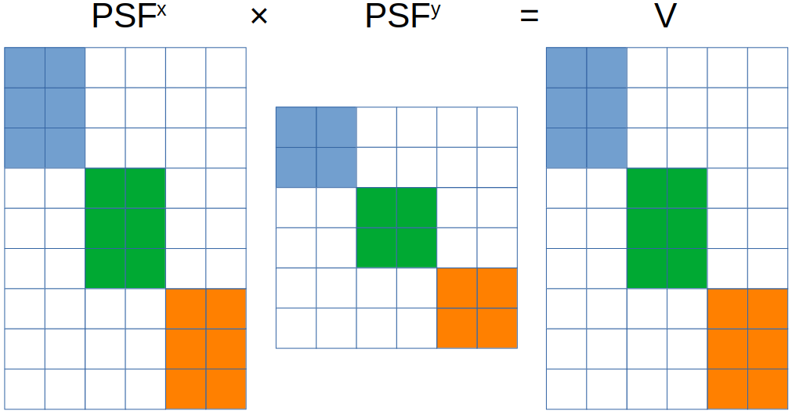

# Optimization Techniques in Scientific Computing (Part III)

- [Optimization Techniques in Scientific Computing (Part III)](#optimization-techniques-in-scientific-computing-part-iii)
  - [Introduction and recap](#introduction-and-recap)
  - [Run code on a GPU](#run-code-on-a-gpu)
    - [First attempt](#first-attempt)
  - [The first implementation](#the-first-implementation)
  - [Optimization ideas](#optimization-ideas)
  - [Parallelism](#parallelism)
    - [Core-level](#core-level)
    - [Node-level](#node-level)
    - [Cluster-level](#cluster-level)
    - [Key consideration](#key-consideration)

## Introduction and recap

In my [previous two blogs](https://labpresse.com/?s=Optimization+Techniques+in+Scientific+Computing) for optimization techniques in scientific computing, I have talked about concepts such as vectorization and parallelism in the context of my single-molecule video simulation[^1], which can be mathematically formulated as calculating 3D array $V$ with $$V_{fij}=\sum_n \exp[-(x^p_{fi}-x_{fn})^2-(y^p_{fj}-y_{fn})^2].$$ We started with `video_sim_v1`

```julia
function video_sim_v1(xᵖ, yᵖ, x, y)
    F = size(x, 2)
    v = Array{eltype(x),3}(undef, length(xᵖ), length(yᵖ), F)
    for f in 1:F
        PSFˣ = exp.(-(xᵖ .- Transpose(view(x, :, f))) .^ 2)
        PSFʸ = exp.(-(view(y, :, f) .- Transpose(yᵖ)) .^ 2)
        v[:, :, f] = PSFˣ * PSFʸ
    end
    return v
end
```

then found that introducing multithreading as follows significantly improves the performance.

```julia
function video_sim_v3(xᵖ, yᵖ, x, y)
    F = size(x, 2)
    v = Array{eltype(x),3}(undef, length(xᵖ), length(yᵖ), F)
    Threads.@threads for f in 1:F
        PSFˣ = exp.(-(xᵖ .- Transpose(view(x, :, f))) .^ 2)
        PSFʸ = exp.(-(view(y, :, f) .- Transpose(yᵖ)) .^ 2)
        v[:, :, f] = PSFˣ * PSFʸ
    end
    return v
end
```

Eventually, `video_sim_v3` yielded a benchmark of `12.925 ms (1450 allocations: 123.47 MiB)` on my eight-thread Intel i7 7700K.

[^1]: In case you haven't read the preceding blogs, I strongly encourage you to take a moment to review their problem description sections. This will provide you with a better picture of the issue I'm trying to address.

In the part II of my blog series, I have also loosely alluded to the dilemma we face in further optimization:

- The number of independent frames can be much larger than the number of threads on a CPU[^2].
- Multiprocessing on a cluster causes significant communication overhead and development challenge, ultimately outweigh the potential performance gain.

[^2]: As of the date of this blog, even the most advanced desktop CPU, AMD Ryzen™ Threadripper™ PRO 5995WX (~$6,000), only has 128 threads, while frame number can easily be over 1,000.

Basically, we want a solution that can efficiently execute numerous relatively lightweight computational tasks in parallel, while maintaining minimal communication overhead. Interestingly, such a solution already exists, and it takes the form of a GPU. According to the experts from [Intel](https://www.intel.com/content/www/us/en/products/docs/processors/cpu-vs-gpu.html),
>The GPU is a processor that is made up of many smaller and more specialized cores. By working together, the cores deliver massive performance when a processing task can be divided up and processed across many cores.

## Run code on a GPU

Originally popularized in the deep learning community, accelerating scientific computations with GPUs is rapidly getting attentions from researchers across various domains. Many thanks to the continuous efforts from scientists and software developers, writing GPU codes has become much easier than it used to be. Under some circumstances, once properly set up, running a code originally written for CPUs on GPUs can be achieved via merely changing a few lines.

At the moment, the three leading companies in chips, Nvidia, AMD, and Intel, all offer their own platforms for GPU computation[^3]. Due to the relatively higher popularity, I will use [CUDA](https://en.wikipedia.org/wiki/CUDA) from Nvidia in this blog. For detailed guidance on installation and integration with Julia, please refer to [CUDA.jl](https://github.com/JuliaGPU/CUDA.jl) and [its documentation](https://cuda.juliagpu.org/stable/).

[^3]: [CUDA](https://en.wikipedia.org/wiki/CUDA) from Nvidia, [ROCm](https://en.wikipedia.org/wiki/ROCm) from AMD, and [OneAPI](https://en.wikipedia.org/wiki/OneAPI_(compute_acceleration)) from Intel.

### First attempt

Once the installation of `CUDA.jl` is completed, verified, and loaded, to run `video_sim_v1` on an Nvidia GPU we simply need to pass arguments as CUDA arrays such as `video_sim_v1(xᵖ, yᵖ, CuArray(x), CuArray(y))`.

You may expect magic to happen but a warning (or sometimes an error) pops up regarding `performing scalar indexing on task`. What's more, the warning message also says `such implementations *do not* execute on the GPU, but very slowly on the CPU`, indicating our first attempt has failed.

The reason for this failure is clear from the warning message: CUDA does not accept scalar indexing of a GPU array such as `v[:, :, f]`, which basically means we have to fully vectorize the code 


has become more popular


 in recent years especially in the deep learning community. 


In this blog I will briefly explain what type of tasks suits GPUs and show, as an example, how I accelerated a calculation in my research using GPUs.


GPU computation, despite being very powerful, is not a key that opens all locks. To understand when to seek help from GPUs we can refer to words from the experts at 

Therefore, the first (and perhaps the most important) step is to recognize if a problem can be solved as many independent sub-problems. A simple example of such a problem is matrix multiplication $C=AB$, as each entry of $C$ is calculated independently via $c_{ij}=\sum_k a_{ik}b_{kj}$.

 with low communication overhead. In fact, such a tool exists and it is the GPU.

1. The formula above does not correspond to any basic vector, matrix, or tensor operation, making full vectorization difficult.

In a perfe

[my previous blog](https://labpresse.com/code-optimization-in-scientific-research-part-i/), I introduced some straightforward yet valuable optimization techniques. While these techniques are generally suitable for relatively simple problems, such as the example presented in my previous blog, they may prove inadequate when dealing with more complex and realistic issues. Specifically, in the previous example, my objective was to simulate a single-molecule microscope image. However, people frequently need to process multiple independent images (e.g., frames in a video). In this blog, I will discuss additional techniques within the context of this video simulation problem.

To quickly recap, the previous example involves calculating the total contribution, labeled as $I$, from all molecules. These molecules are indexed by $n$, and they relate to each pixel, which is indexed by $i$ and $j$. Referring to the assumptions discussed earlier, we can express the algorithm's mathematical form as follows: $$I_{ij}=\sum_n \exp[-(x^p_i-x_n)^2-(y^p_j-y_n)^2].$$ Now, shifting our focus to the present issue that involves multiple independent images (or frames), we extend the same calculation to each individual image, denoted as $f$. As a result, the mathematical representation for this new problem takes the following shape (where $V$ stands for video): $$V_{fij}=\sum_n \exp[-(x^p_{fi}-x_{fn})^2-(y^p_{fj}-y_{fn})^2].$$  

## The first implementation

Based on the description so far, we can readily enclose a for-loop iterating over $f$ around the previously optimized code to create the initial version of our single-molecule video simulation code[^1]:

```julia
function video_sim_v1(xᵖ, yᵖ, x, y)
    F = size(x, 2)
    v = Array{eltype(x),3}(undef, length(xᵖ), length(yᵖ), F)
    for f in 1:F
        PSFˣ = exp.(-(xᵖ .- Transpose(view(x, :, f))) .^ 2)
        PSFʸ = exp.(-(view(y, :, f) .- Transpose(yᵖ)) .^ 2)
        v[:, :, f] = PSFˣ * PSFʸ
    end
    return v
end
```

[^1]: `view(x, :, f)` serves the same purpose as `x[:, f]` but with smaller memory allocation.

Two points to note in the code above:

- `x` and `y` are both arrays of dimensions $N\times F$, where $N$ and $F$ represent the number of molecule and number of frames, respectively.
- It appears that we have made a bold assumption that all frames contain an equal number of molecules. However, this assumption is acceptable since molecules that should not appear in a frame can be positioned far away from the field-of-view, thereby making no contribution.

Benchmarking `video_sim_v1` using a dataset comprising 20 molecules and 100 frames (each with 256$\times$256 pixels) yields `50.927 ms (1402 allocations: 123.47 MiB)`. Our overarching goal entails improving upon this benchmark.

## Optimization ideas

Before exploring new techniques, let's take a moment to consider whether we can apply anything from [my previous blog](https://labpresse.com/code-optimization-in-scientific-research-part-i/). Since we have only added one extra loop, there isn't much opportunity to reduce memory allocation. What's more, this extra loop cannot be easily eliminated through vectorization, as the formula specified here doesn't align with basic matrix (or tensor) operations. Consequently, we must use other techniques to tackle this challenge.

In this video simulation problem, it is important to note that all frames are independent of each other. As a result, there is potential to simulate frames simultaneously, or in other words, in parallel.

## Parallelism

Parallelizing an algorithm is much easier said than done. In view of the intricate nature of contemporary computational infrastructures, attaining parallelism in the present era involves three major tiers: core-level parallelism, node-level parallelism, and cluster-level parallelism[^2]. In the upcoming sections, I will delve into a single common scheme within each tier and examine its relevance within the context of our specific problem.

[^2]: Please note that these concepts are not mutually exclusive.

### Core-level

This initial question that may arise is: how is it possible to achieve parallelism on a single core? To illustrate this, let's consider a situation where a program operates on 64-bit integers, and a processor core possesses the capability to fetch 256 bits of data in a solitary operation. In such a scenario, it becomes viable to load four integers as a vector and perform a singular vectorized iteration of the original operation. This could potentially yield a theoretical speedup of fourfold[^3]. This particular approach to parallelization is commonly known as "[single instruction, multiple data](https://en.wikipedia.org/wiki/Single_instruction,_multiple_data)" (SIMD).

[^3]: You should now recognize that SIMD is closely related to vectorization (introduced in [my previous blog](https://labpresse.com/code-optimization-in-scientific-research-part-i/#vectorization)). In fact, vectorization constitutes a specific implementation of SIMD principles.

The straightforward concept of SIMD, on one hand, allows numerous modern programming languages to identify points within an algorithm where SIMD can be employed and subsequently apply it automatically. On the other hand, SIMD is frequently constrained to basic operations such as addition or multiplication. Hence, the potential enhancement of `video_sim_v1` through this method remains uncertain. Nevertheless, in this scenario, an attempt must be made to explore the possibilities.

In [Julia](https://julialang.org/), it is possible to enforce vectorization by employing the `@simd` macro, placed before a for-loop involving independent iterations. This technique results in the creation of `video_sim_v2`:

```julia
function video_sim_v2(xᵖ, yᵖ, x, y)
    F = size(x, 2)
    v = Array{eltype(x),3}(undef, length(xᵖ), length(yᵖ), F)
    @simd for f in 1:F
        PSFˣ = exp.(-(xᵖ .- Transpose(view(x, :, f))) .^ 2)
        PSFʸ = exp.(-(view(y, :, f) .- Transpose(yᵖ)) .^ 2)
        v[:, :, f] = PSFˣ * PSFʸ
    end
    return v
end
```

A benchmark analysis yields a result of `51.017 ms (1402 allocations: 123.47 MiB)`, indicating a lack of performance improvement. It seems that Julia has indeed automatically vectorized the code in this case.

### Node-level

Moving up a level there is parallelism on a node (often a computer), which is often achieved through [multithreading](https://en.wikipedia.org/wiki/Multithreading_(computer_architecture)). For multithreading, we require multiple processors (either physical or virtual[^4]), with each core being associated with a separate thread. Multithreading facilitates the simultaneous execution of these processors, all while utilizing the same memory pool. It is important to note that the implementation of multithreading demands careful consideration to avoid conflicts between threads. Fortunately, developers have often shouldered much of this responsibility, alleviating users of this burden.

[^4]: For example, see [hyper-threading](https://en.wikipedia.org/wiki/Hyper-threading)

In Julia, multithreading a for-loop can be as easy as follows[^5]:
[^5]: In order to enable multithreading, certain programming languages may require additional parameters during startup. You can find instructions on how to accomplish this in Julia on [this page](https://docs.julialang.org/en/v1/manual/multi-threading/) shows how to do it in Julia.

```julia
function video_sim_v3(xᵖ, yᵖ, x, y)
    F = size(x, 2)
    v = Array{eltype(x),3}(undef, length(xᵖ), length(yᵖ), F)
    Threads.@threads for f in 1:F
        PSFˣ = exp.(-(xᵖ .- Transpose(view(x, :, f))) .^ 2)
        PSFʸ = exp.(-(view(y, :, f) .- Transpose(yᵖ)) .^ 2)
        v[:, :, f] = PSFˣ * PSFʸ
    end
    return v
end
```

My desktop computer is equipped with four physical CPU cores, which translate into eight threads. When assessing the benchmark of `video_sim_v3` with all eight threads, the results demonstrate a remarkable speedup of almost four times comparing to `video_sim_v1`, clocking in at `12.925 ms (1450 allocations: 123.47 MiB)`.

### Cluster-level

Now assume you have access to a cluster, which is not uncommon for universities and institutes nowadays, you could even consider modifying the algorithm to execute across multiple processors spanning numerous computers. A frequently employed strategy involves the utilization of [multiprocessing](https://en.wikipedia.org/wiki/Multiprocessing).

With the concept of multithreading in mind, we can easily comprehend multiprocessing as the simultaneous operation of multiple processors, where each core has access only to its designated memory space. This fundamental distinction from multithreading requires some "coding maneuvers" as users are now compelled to determine the allocation of data to individual processors. In the context of our example problem, implementing multiprocessing requires some rather major change of the code, contradicting the very impetus driving my blog posts. Therefore, I only provide a preliminary example in [this GitHub repository of mine]().

### Key consideration

<p align="center" height="100%">
    
</p>

While I aimed to maintain a surface-level discourse in my blog, it is totally reasonable to feel confused when deciding upon a parallelization scheme. :smile: The crucial factor to bear in mind is that an escalation in the number of processors engaged directly corresponds to an increase in communication overhead. This rise in overhead can potentially overshadow the performance benefits gained from task distribution.

As of the post date of this blog, it is generally advisable to experiment with SIMD and multithreading in your code, as they are relatively easier to test. On the other hand, when it comes to multiprocessing, it is recommended to consider its implementation only when each discrete task consumes several seconds to execute, and the level of inter-process communication remains minimal.

Although it has been a long journey, our quest remains incomplete. There is one more concept, which is gaining popularity in recent years, that we can test. In the third part of my blog, I will discuss GPU computation.
