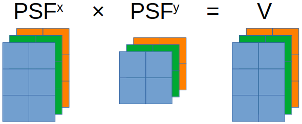

# Optimization Techniques in Scientific Computing (Part III)

- [Optimization Techniques in Scientific Computing (Part III)](#optimization-techniques-in-scientific-computing-part-iii)
  - [Introduction and recap](#introduction-and-recap)
  - [Run code on a GPU](#run-code-on-a-gpu)
    - [First attempt](#first-attempt)
    - [Further vectorization](#further-vectorization)
    - [Batch matrix multiplication](#batch-matrix-multiplication)
    - [Final boost](#final-boost)
  - [Conclusion](#conclusion)

## Introduction and recap

In my [previous two blogs](https://labpresse.com/?s=Optimization+Techniques+in+Scientific+Computing) for optimization techniques in scientific computing, I have talked about concepts such as vectorization and parallelism in the context of my single-molecule video simulation[^1], which can be mathematically formulated as calculating 3D array $V$ with $$V_{fij}=\sum_n \exp[-(x^p_{fi}-x_{fn})^2-(y^p_{fj}-y_{fn})^2].$$ We started with `video_sim_v1`

```julia
function video_sim_v1(xᵖ, yᵖ, x, y)
    F = size(x, 2)
    v = Array{eltype(x),3}(undef, length(xᵖ), length(yᵖ), F)
    for f in 1:F
        PSFˣ = exp.(-(xᵖ .- Transpose(view(x, :, f))) .^ 2)
        PSFʸ = exp.(-(view(y, :, f) .- Transpose(yᵖ)) .^ 2)
        v[:, :, f] = PSFˣ * PSFʸ
    end
    return v
end
```

then found that introducing multithreading as follows significantly improves the performance.

```julia
function video_sim_v3(xᵖ, yᵖ, x, y)
    F = size(x, 2)
    v = Array{eltype(x),3}(undef, length(xᵖ), length(yᵖ), F)
    Threads.@threads for f in 1:F
        PSFˣ = exp.(-(xᵖ .- Transpose(view(x, :, f))) .^ 2)
        PSFʸ = exp.(-(view(y, :, f) .- Transpose(yᵖ)) .^ 2)
        v[:, :, f] = PSFˣ * PSFʸ
    end
    return v
end
```

Eventually, `video_sim_v3` yields a benchmark of `12.925 ms (1450 allocations: 123.47 MiB)` on my eight-thread Intel i7 7700K.

[^1]: In case you haven't read the preceding blogs, I strongly encourage you to take a moment to review their problem description sections. This will provide you with a better picture of the issue I'm trying to address.

In the part II of my blog series, I have also loosely alluded to the dilemma we face in further optimization:

- The number of independent frames can be much larger than the number of threads on a CPU[^2].
- Multiprocessing on a cluster causes significant communication overhead and development challenge, ultimately outweigh the potential performance gain.

[^2]: As of the date of this blog, even the most advanced desktop CPU, AMD Ryzen™ Threadripper™ PRO 5995WX (~$6,000), only has 128 threads, while frame number can easily be over 1,000.

Basically, we want a solution that can efficiently execute numerous relatively lightweight computational tasks in parallel, while maintaining minimal communication overhead. Interestingly, such a solution already exists, and it takes the form of a GPU. According to the experts from [Intel](https://www.intel.com/content/www/us/en/products/docs/processors/cpu-vs-gpu.html),
>The GPU is a processor that is made up of many smaller and more specialized cores. By working together, the cores deliver massive performance when a processing task can be divided up and processed across many cores.

## Run code on a GPU

Originally popularized in the deep learning community, accelerating scientific computations with GPUs is rapidly getting attentions from researchers across various domains. Many thanks to the continuous efforts from scientists and software developers, writing GPU codes has become much easier than it used to be. Under some circumstances, once properly set up, running a code originally written for CPUs on GPUs can be achieved via merely changing a few lines.

At the moment, the three leading companies in chips, Nvidia, AMD, and Intel, all offer their own platforms for GPU computation[^3]. Due to the relatively higher popularity, I will use [CUDA](https://en.wikipedia.org/wiki/CUDA) from Nvidia in this blog. For detailed guidance on installation and integration with Julia, please refer to [CUDA.jl](https://github.com/JuliaGPU/CUDA.jl) and [its documentation](https://cuda.juliagpu.org/stable/).

[^3]: [CUDA](https://en.wikipedia.org/wiki/CUDA) from Nvidia, [ROCm](https://en.wikipedia.org/wiki/ROCm) from AMD, and [OneAPI](https://en.wikipedia.org/wiki/OneAPI_(compute_acceleration)) from Intel.

### First attempt

Once the installation of `CUDA.jl` is completed, verified, and loaded, to run `video_sim_v1` on an Nvidia GPU we simply need to pass arguments as CUDA arrays such as `video_sim_v1(CuArray(xᵖ), CuArray(yᵖ), CuArray(x), CuArray(y))`.

You may expect magic to happen but a warning (or sometimes an error) pops up regarding `performing scalar indexing on task`. What's more, the warning message also says `such implementations *do not* execute on the GPU, but very slowly on the CPU`, indicating our first attempt has failed. The cause behind this failure is clear from the warning message: CUDA does not accept scalar indexing of a GPU array, like `v[:, :, f]`. Consequently, the solution entails a complete vectorization of the code, eliminating the need for the for-loop iteration over $f$.

### Further vectorization

As stated multiple times thus far, our problem does not align directly with any basic vector operation. However, we can be clever and slightly restructure our data, enabling the potential for vectorization. An approach to achieve this is illustrated in the following figure.

<p align="center" height="100%">
    
</p>

Here, $PSF^x$, $PSF^y$, and $V$ are restructured as block-diagonal matrices. Blocks sharing the same color correspond to the same frame, while any remaining elements within these matrices are set to zero, visually represented as white-colored sections. As a result, all the frames can be simulated through one matrix multiplication.

While this approach is indeed valid, I would not recommend implementing it by yourselves. This is due to the potentially vast dimensions of these block matrices. A naive implementation lacking efficient memory allocation handling could greatly worsen overall performance.

Are there better solutions? The answer is yes. This problem we are facing, namely numerous independent (and typically small) matrix multiplications of identical sizes, is not unique to us. In fact, it is common enough that people have named it "batch matrix multiplication".

### Batch matrix multiplication

<p align="center" height="100%">
    
</p>

Although batch matrix multiplication is widely recognized and efficiently implemented, it may not always be easy to find the correct function within your programming language. Occasionally, batch matrix multiplication goes by different names. For instance, in MATLAB, it is referred to as "[page-wise matrix multiplication](https://www.mathworks.com/help/matlab/ref/pagemtimes.html)". In certain cases, additional packages are required, and quite often, these packages belong deep-learning libraries! In Python, you can call `torch.bmm` from [PyTorch](https://pytorch.org/docs/stable/generated/torch.bmm.html), while Julia offers `batched_mul` through [Flux.jl](https://fluxml.ai/Flux.jl/stable/models/nnlib/#NNlib.batched_mul). Using `batched_mul`, we can write a new code as follows:

```julia
function video_sim_GPU_v2(xᵖ, yᵖ, x, y)
    PSFˣ = exp.(-(reshape(x, 1, size(x)...) .- xᵖ) .^ 2)
    PSFʸ = exp.(-(reshape(y, 1, size(y)...) .- yᵖ) .^ 2)
    return batched_mul(PSFˣ, batched_adjoint(PSFʸ))
end
```

Here, `reshape` is called to construct `PSFˣ` and `PSFˣ` as 3D arrays, and `batched_adjoint` is just the "batched" version of transpose.

Benchmarking `video_sim_GPU_v2` on my CPU (i7 7700K) and my GPU (GeForce GTX 1060) yield `9.550 ms (75 allocations: 73.44 MiB)` and `3.127 ms (9 GPU allocations: 73.468 MiB`[^4], respectively. Both of them are beating the multithreaded `video_sim_v3`!

### Final boost

The benchmarks I've showcased so far are based on double-precision float-point (float64) numbers. However, GPUs are frequently optimized for single-precision float-point (float32) numbers. For instance, once switched to using float32, `video_sim_GPU_v2`'s benchmark becomes `660.627 μs (11 GPU allocations: 36.736 MiB)`, another fivefold acceleration!

Therefore, it is frequently advantageous to craft your GPU code to support both float64 and float32, and then assess whether altering the datatype affects your outcome. If there's no impact, simply proceed with float32!

[^4]: GPU memory allocation is measured by `CUDA.@time`, see this [page](https://cuda.juliagpu.org/stable/development/profiling/).

## Conclusion

Finally, we have arrived at the conclusion of my blog series concerning optimization techniques for scientific computation. I hope you have enjoyed this journey and learned something useful. Please feel free to get in touch with me should you wish to connect or share your thoughts!