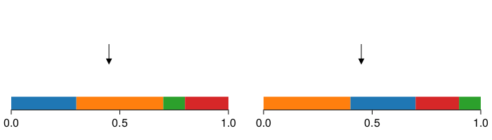

# Categorical distribution and Gumbel distribution

- [Categorical distribution and Gumbel distribution](#categorical-distribution-and-gumbel-distribution)
  - [Categorical distribution](#categorical-distribution)
  - [Sample from a categorical distribution](#sample-from-a-categorical-distribution)
  - [Unnormalized probabilities](#unnormalized-probabilities)
  - [Log probabilities](#log-probabilities)
    - [LogSumExp](#logsumexp)
    - [Softmax](#softmax)
  - [The standard Gumbel distribution](#the-standard-gumbel-distribution)
    - [Sampling from the standard Gumbel distribution](#sampling-from-the-standard-gumbel-distribution)
    - [The Gumbel-max trick](#the-gumbel-max-trick)

## Categorical distribution

Categorical distribution is probably the most common probability distribution, frequently encountered across a broad spectrum of scenarios: from classic dice-based games to the task of image classification within the realm of computer vision. At its core, the concept of categorical distribution is rather straightforward: it describes the probabilities of occurrence of the possible outcomes (or "categories") of an event. In fact, nearly all probability distributions featuring discrete outcomes can be thought of as special cases of categorical distributions, wherein event probabilities are articulated through distinct functions.

## Sample from a categorical distribution

Working with categorical distributions, there is often need to simulate their outcomes, or more precisely, to sample from these distributions. The most fundamental and straightforward sampling scheme for a categorical distribution is known as "stick-breaking", as illustrated in the figure below.

<p align="center" height="100%">
    
</p>

To understand stick-breaking with this figure, consider the event of breaking a one-unit-length stick. Here, the stick is partitioned into discrete regions, each uniquely colored. Our objective is to select a specific location to break the stick, essentially determining the outcome of this event. Assuming an unbiased selection process, the probability of breaking the stick within a particular region precisely corresponds to the size of that region, regardless how all regions are arranged.

Therefore, to sample from any categorical distribution:

1. Provide all event probabilities as entries of a vector[^1] (create a one-unit-length stick and its partitions).
2. Draw a random number that is uniformly distributed between zero and one (unbiasedly choose a location).
3. Find in which region this location lies, return the region label as the sample.

[^1]: This scheme is only suitable for distributions with a finite number of categories.

Implementing the stick-breaking algorithm is simple, with [Julia](https://julialang.org/) as the example programming language we can write

```julia
function categorical_sampler1(p)
    i = 1
    c = p[1]
    u = rand()
    while c < u
        c += p[i+=1]
    end
    return i
end
```

While the stick-breaking algorithm is simple and straightforward, it is important to address a couple of practical concerns that can arise. Two common concerns involve unnormalized probabilities and log probabilities.

## Unnormalized probabilities

Be definition, a probability distribution should be normalized, indicating that its probabilities or probability density function (PDF) ought to sum up or integrate to one. Nevertheless, normalizing every encountered distribution is typically not preferred for two primary reasons:

1. Normalization factors are typically constant multiplicative coefficients that have no impact on the actual algorithm's outcomes.
2. Computing the normalization factor of a complex probability distribution can be exceedingly challenging.

Dealing with unnormalized probabilities within in stick-breaking scheme is very simple. All we need to do is adjust the length of the "stick" to match the actual sum of probabilities. This adjustment can be achieved by replacing `u = rand()` with `u = rand() * sum(p)` in the `categorical_sampler1` function.

## Log probabilities

Working with probability distributions, there is a frequent requirement to compute the products of probabilities, such as when determining the intersection of events. Depending on the number of terms involved and their respective normalization factors, the value of these products can become very large or very small. Both cases can potentially result in numerical stability problems. Consequently, it is a standard practice to utilize log probabilities, which are the natural logarithms of the actual probabilities, throughout the entire computation process.

### LogSumExp

Unlike the simple modification to incorporate unnormalized probabilities, sampling from a categorical distribution given its log event probabilities is tricky. The problem here is how to calculate $\ln(p_1+p_2)$ given $\ln p_1$ and $\ln p_2$, where $p_1$ and $p_2$ are event probabilities. One workaround is to use the mathematical identity $$\ln(p_1+p_2)=\alpha+\ln[\exp(\ln p_1-\alpha)+\exp(\ln p_2-\alpha)].$$ In this equation, we select the value of $\alpha$ in a manner that ensures the numerical stability of computing $\exp(\ln p_1 - \alpha)$ and $\exp(\ln p_2 - \alpha)$ over directly calculating $\exp(\ln p_1)$ and $\exp(\ln p_2)$[^2]. This algorithm is widely implemented in software packages. For instance, in Julia, it is called `logaddexp` in [LogExpFunctions.jl](https://juliastats.org/LogExpFunctions.jl/stable/). Similarly, there is also `logsumexp` which generalizes `logaddexp` to more than two operands. Therefore, we can write a new sampler as follows:

```julia
function categorical_sampler2(logp)
    i = 1
    c = logp[1]
    u = log(rand()) + logsumexp(logp)
    while c < u
        c = logaddexp(c, logp[i+=1])
    end
    return i
end
```

[^2]: People typically choose the larger value between $\ln p_1$ and $\ln p_2$ to be $\alpha$.

### Softmax

Another closely related approach involves transforming all log probabilities into normalized probabilities within the real space, with enhanced numerical stability[^3]. This procedure is commonly referred to as the `softmax` function:$$\mathrm{softmax}(\ln p_1,\ln p_2, \dots\ln p_N)_n=\frac{p_n}{\sum_n p_n}.$$ With `softmax`, instead of writing any new functions, we can simply call `categorical_sampler1(softmax(logp))`.

While both `logsumexp` and `softmax` are valid approaches, neither is entirely free of the numerical instability risk: they still require some calculations in the real space. Remarkably, it is conceivable to accomplish all computations exclusively within the logarithmic space using the [standard Gumbel distribution](https://en.wikipedia.org/wiki/Gumbel_distribution#Standard_Gumbel_distribution).

## The standard Gumbel distribution

The standard Gumbel distribution is a special case of the Gumbel distribution where the two parameters, location and scale are equal to zero and one, respectively. Consequently, the PDF for the standard Gumbel distribution takes the form: $$f\left(x\right)=\exp\left[-x-\exp\left(-x\right)\right].$$ Although this PDF may appear daunting due to the presence of an exponential within the exponent, it in fact yields two outcomes. These outcomes will be explained in greater detail in the following sections, and they assist us in generating samples from a categorical distribution.

### Sampling from the standard Gumbel distribution

The first outcome is how easy it is to sample from the standard Gumbel distribution: its PDF can actually be analytically integrated to obtain an invertible cumulative distribution function (CDF) $$F\left(x\right)=\exp\left[-\exp\left(-x\right)\right],$$ while its inverse is $$F^{-1}\left(u\right)=-\ln\left(-\ln u \right).$$ Therefore, according to the [fundamental theorem of simulation](https://en.wikipedia.org/wiki/Inverse_transform_sampling#Formal_statement), sampling from the standard Gumbel distribution is as easy as calculating $F^{-1}\left(u\right)$ where $u$ is a uniform random number between zero and one.

### The Gumbel-max trick

Now, consider having a target categorical distribution with $N$ unnormalized logarithmic event probabilities represented as $\ln p_1,\ln p_2,\dots,\ln p_N$. Using the algorithm outlined earlier, we can effortlessly generate an equivalent number of independent and identically distributed random variables following the standard Gumbel distribution: $x_1,x_2,\ldots,x_N$. Interestingly, when we compute the probability of $n$ being the index that maximizes the expression $x_n + \ln p_n$, it turns out to be precisely $p_n/\sum_{n=1}^N p_n$. This indicates that $x_n + \ln p_n$ itself is a random variable that precisely follows the target categorical distribution!

This result is often referred to as the "Gumbel-max trick". Although I provide the full derivation in [this document](), deriving this result by yourself is highly recommended. Implementing this trick in Julia can be done as:

```julia
function categorical_sampler3(logp)
    x = -log.(-log.(rand(length(logp))))
end
```